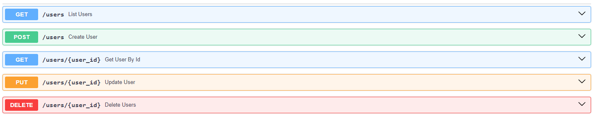

# FastAPI
Este projeto demonstra a construção de uma [API RESTful]([https://aws.amazon.com/pt/what-is/restful-api/]) robusta e eficiente utilizando principalmente Python, Pydantic, FastAPI e um banco de dados MySQL. A API apresenta os principais endpoints para a construção de um arquitetura sólida baseada nas boas práticas.

*   **[GET] /usuarios:** Lista todos os usuários;
*   **[GET] /usuarios/{id}:** Retorna um usuário específico com base na busca do ID;
*   **[POST] /usuarios:** Cria um novo usuário;
*   **[PUT] /usuarios/{id}:** Atualiza um usuário existente;
*   **[DELETE] /usuarios/{id}:** Remove um usuário



# Sumário
   * [Tecnologias](#️ferramentas-e-tecnologias-utilizadas)
   * [Sobre a FastAPI](#️sobre-a-fast-api)
   * [Instalação](#️instalação)
   * [Execução da aplicação](#execução)
   * [Contribuição](#contribuição)

# Ferramentas e tecnologias utilizadas
*   **Python:** Linguagem de programação back-end;
*   **Pydantic:** Biblioteca para validação de dados e serialização;
*   **FastAPI:** Framework web moderno e de alto desempenho para construção de APIs;
*   **MySQL:** Banco de dados relacional para persistência de dados;
*   **MySQL Connector Python:** Biblioteca que estabelece de forma simples conexão entre a linguagem Python com SGBD MySQL;
*   **Uvicorn:** Servidor ASGI para executar a aplicação FastAPI;
*   **Docker:** Plataforma open-source que permite o empacotamento do software, proporcionando escalabilidade e independência de unidades executáveis;
*   **Insomnia:** Plataforma utilizada para realização de testes de endpoints;
*   **Pytest:** Framework para testes unitários e de integração

## Sobre a FastAPI
[FastAPI]([https://fastapi.tiangolo.com/learn/]) é um framework web moderno e de alto desempenho para construir APIs com Python. Ele se destaca por sua velocidade, facilidade de uso e recursos avançados, tornando-o uma excelente escolha para projetos back-end de todos os tamanhos. Se destaca por suas principais características:

* Velocidade: FastAPI é extremamente rápido, proporcionando uma aplicação com um desempenho excepcional, respondendo às solicitações de forma rápida e eficiente;

* Facilidade de uso: O framework foi projetado para ser fácil de aprender e usar, mesmo para desenvolvedores iniciantes. Sua sintaxe é intuitiva e sua documentação é clara e completa;

* Tipagem estática: FastAPI utiliza tipagem estática com Python, o que ajuda a prevenir erros e torna o código mais robusto e confiável;

* Validação de dados: FastAPI integra-se com o Pydantic para fornecer validação de dados automática e eficiente. Isso garante que os dados recebidos pela API estejam corretos e consistentes;

* Documentação interativa: FastAPI gera automaticamente documentação interativa da API no formato OpenAPI (Swagger UI), facilitando o teste, manutenção e a compreensão da API por outros desenvolvedores;

* Recursos avançados: FastAPI oferece recursos avançados como autenticação, autorização, gerenciamento de dependências e muito mais, permitindo que você construa APIs complexas e completas;

* Integração com outras ferramentas: FastAPI integra-se facilmente com outras ferramentas populares do ecossistema Python, como bancos de dados relacionais e não relacionais, ferramentas de teste e muito mais

## Instalação
1. Primeiramente, clone o repositório:

    ```
    git clone https://github.com/david-castanheira/fastapi-python.git
    ```

2. Acesse a pasta do projeto no terminal ou CMD:

    ```
    cd fastapi
    ```

3. Execute o seguinte comando para instalar todas as dependências do projeto:
    
    ```
    pip install requirements.txt
    ```

4. Configure as variáveis de ambiente:

    *   Crie um arquivo `.env` na pasta 'config' do projeto;
    *   Defina as mesmas credenciais definidas no momento da instalação do MySQL

## Execução
1. Inicie o servidor Uvicorn:

    ```
    uvicorn app:app
    ```

2. Acesse a documentação interativa Swagger em:

    ```
    http://localhost:8000/docs
    ```

# Contribuição
Contribuições são sempre bem-vindas! Se você tiver ideias para melhorar este projeto, sinta-se à vontade para abrir uma issue ou enviar um pull request

